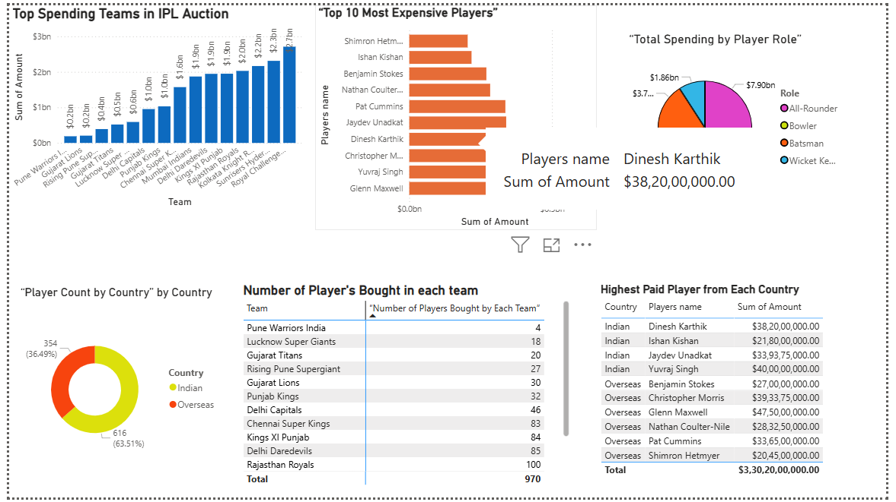

# 🏏 IPL Auction Analysis

A Power BI dashboard project analyzing IPL auction data to uncover insights on team spending, player distribution, and country-wise trends.

---

## 🔍 Analysis Highlights

This project answers the following key questions:

1. 💰 Which team spent the most money in the IPL auction?
2. 🏆 Who are the top 10 most expensive players in the auction?
3. 🎯 How much money was spent on each player role?
4. 🌍 What is the distribution of Indian vs. overseas players?
5. 🧾 How many players were bought by each IPL team?
6. 🇮🇳 Who is the highest-paid player from each country?

---

## 🧰 Tools Used

- Power BI
- Microsoft Excel / CSV
- Dataset source: [Kaggle IPL Auction Data](https://www.kaggle.com/)

---

## 📂 Project Structure

---

## 🚀 How to Use

1. Clone or download this repository.
2. Open the file `project_ipl_auction.pbix` in Power BI Desktop.
3. Ensure the dataset (`IPLPlayerAuctionData.csv`) is in the `dataset/` folder.
4. Refresh the data if needed.
5. Explore the dashboard visuals and insights.

---

## 📸 Dashboard Preview

*(You can upload a screenshot here later and add it like below)*

```markdown


---


